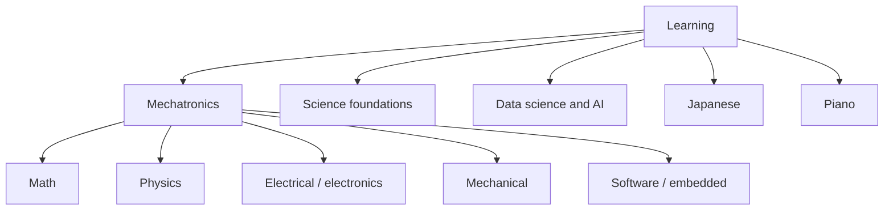

# Learning Topic Tree

Short hierarchy and dependency map. **Names and edges only.** Active status
lives only in [[Mechatronics/ROADMAP|the ROADMAP]]. Milestone acceptance lives
in `Mechatronics/milestones/`; concept state and sources live in
`_system/learning/curriculum/`.

Detailed former notes are staged in
[[_system/learning/archive/topic-tree-details|the historical topic-tree note]].

## Ownership rules

- A leaf topic is one claim-sized, gradeable aim that fits roughly one lesson.
- Internal subject names are routing labels, not lessons.
- Every active topic names its prerequisites and links to its owning roadmap or
  milestone.
- A source is selected JIT for an activated concept; this tree never stores a
  source catalogue.
- Progress status never appears here.
- Japanese grammar, output, reading, and immersion are coordinated tracks;
  Anki owns vocabulary.

## Domain map



## Mechatronics dependency spine

```text
Math foundations
  → physics models
    → circuits, signals, actuators
      → embedded control
        → mechanical integration
          → verification and portfolio
```

### Math foundations

- Calculus and ODEs
- Linear algebra and frames
- Probability, statistics, and uncertainty
- Numerical methods and simulation
- Fourier/signals where activated

### Physics foundations

- Newtonian dynamics, energy, and momentum
- Rotation and oscillation
- Electromagnetism and induction
- Thermodynamics and heat
- Materials physics and failure

### Electrical / electronics

- Circuit theory, KCL/KVL, and measurement
- Signals, sampling, filters, and frequency response
- Power electronics and thermal limits
- Control theory, state space, and observers
- Digital/embedded timing and communication

### Mechanical / mechatronics

- Statics, dynamics, and mechanisms
- Materials, failure, and machine elements
- Manufacturing, tolerance, and DFMA
- CAD/FEA, interfaces, and testbeds

### Software / embedded

- C, C++, Python, and numerical methods
- Real-time execution and concurrency
- Protocols, CAN, and testable interfaces

Detailed mechatronics deliverables, dependencies, and keywords live in
[[Mechatronics/ROADMAP|the ROADMAP]] and the milestone files.

## Science and data-science edges

- Science owns laws and models; mechatronics applies them.
- Data science owns data quality, estimation, and uncertainty methods.
- Telemetry and characterization connect physical artifacts to data science.
- Jupyter/Python serves simulation, analysis, and evidence review.

## Japanese

- `japanese-grammar` — one usable grammar contrast at a time.
- `japanese-output` — i+1 conversation and daily written/spoken output.
- `japanese-reading` — learner-chosen novel; English-first for 30 actual
  sessions, Japanese-first afterwards.
- `japanese-immersion` — input and optional event logging; no quota.
- Anki — vocabulary and mined-word owner.

## Cross-domain links to name when a topic activates

- vectors/frames → statics/kinematics/dynamics
- conservation laws → physical mechanisms and power budgets
- measurement/uncertainty → every characterization
- interface contracts → embedded/mechanical integration
- verification requirements → every graded artifact
- source locators → activated curriculum dossiers, never this tree

## Review maintenance

Review state and usage events are stored in curriculum files and operated by
`python3 scripts/review.py`; this map is never a status board.
