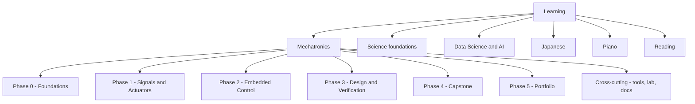
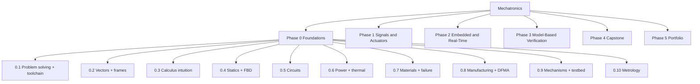
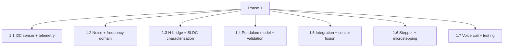
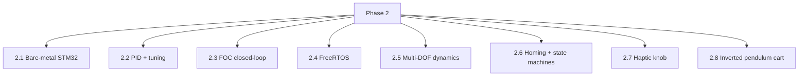
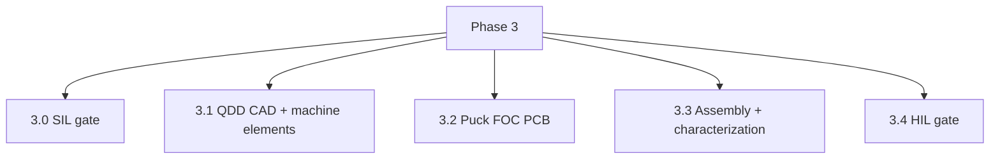
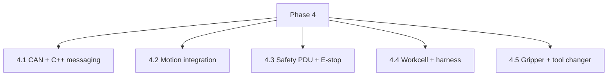
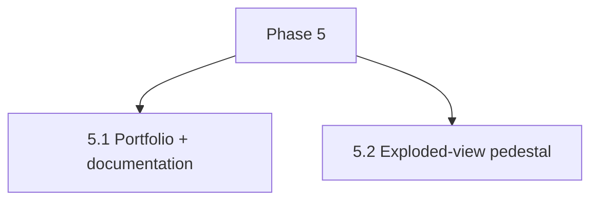

# Learning Topic Tree

Curriculum structure for the vault learning system. **Names only** - resources
are JIT per topic (scout + verifier when the topic activates; never prefetch the
tree). Progress status lives in [[Mechatronics/ROADMAP|the ROADMAP]] only.

## Rules

- A **leaf topic** = one claim-sized aim: fits roughly one lesson, gradeable,
  concrete. Example: "atan2 vs atan - quadrant ranges; robotics always uses
  atan2(y, x)". Not "trigonometry".
- **Internal nodes are abstract subjects** - never taught directly.
- `[decompose at activation]` = unit is named; its topic list is extracted from
  the owning file right before the first lesson on it.
- `[proposed]` = not in the vault yet; needs a vault edit or a scout pass.
- Mech topics derive from `Mechatronics/milestones/*` - the files stay the
  source of truth; this tree is the map.
- Review notes at the bottom: what was checked, what is missing, what to change
  in the vault.
- **Linking is the point.** Every lesson's Connect beat names (a) the theory the
  topic rests on and where it lives, (b) at least one previously learned topic
  or the goal. New load-bearing theory becomes its own topic and links back to
  the practice it serves. Theory nodes are checked by application (derive or use
  it in the practice context), never by recital.
- **Everything links, both ways.** Each practice topic links to the theory it
  rests on, its problems, and the lessons where it was taught. Theory links back
  to the practices and problems that used it; lessons link to both. A missing
  link means the artifact is incomplete. An edge must name its mechanism (one
  sentence: why does this follow?). Conventions (sign rules, right-hand rules,
  unit standards) are labeled as conventions; no link is manufactured for
  decoration.

## Overview



## Composition

Mechatronics is a composition; the disciplines underneath are the linked
theories. A practice topic without its theory is memorization.

```mermaid
graph TD
  MECH[Mechatronics] --> SW[Software / CS]
  MECH --> ME[Mechanical engineering]
  MECH --> EE[Electrical engineering]
  MECH --> PH[Physics]
  MECH --> MA[Math]
  MA --> MA1[Calculus and ODEs]
  MA --> MA2[Linear algebra]
  MA --> MA3[Probability and statistics]
  MA --> MA4[Fourier and signals]
  MA --> MA5[Numerical methods]
  PH --> PH1[Classical mechanics]
  PH --> PH2[Oscillations and waves]
  PH --> PH3[Thermodynamics and heat]
  PH --> PH4[Electromagnetism]
  PH --> PH5[Materials physics]
  EE --> EE1[Circuit theory]
  EE --> EE2[Signals and systems]
  EE --> EE3[Power electronics]
  EE --> EE4[Control theory]
  EE --> EE5[Digital and embedded]
  ME --> ME1[Statics and dynamics]
  ME --> ME2[Materials and failure]
  ME --> ME3[Machine elements]
  ME --> ME4[Manufacturing and DFM]
  SW --> SW1[Programming - C, C++, Python]
  SW --> SW2[Real-time and concurrency]
  SW --> SW3[Protocols and comms]
```



## Theory spine and links

Ownership rule: Science owns the laws ([[Science/Index]]); milestones own the
practice. EE/ME/SW theory currently lives inside the milestones and is
decomposed at activation.

**Math** (Science `math-foundations`) `[decompose at activation]`
- Calculus - derivatives, integrals, chain rule, Taylor, kinematic chains
- Linear algebra - matrix-as-transform, eigen, projection, least squares
- Probability & statistics - distributions, Bayes, CLT, variance, estimation
- Fourier & signals `[proposed]` - series, FFT, spectral analysis, filters
- Numerical methods `[proposed]` - root finding, ODE solvers, stability

**Physics** (Science `physics-first-principles`) `[decompose at activation]`
- Classical mechanics - Newton, momentum/energy, rotation, Lagrangian
- Oscillations & waves - SHM, damping, resonance, wave basics
- Thermodynamics & heat - first law, conduction, thermal resistance
- Electromagnetism - charge, field, current, magnetic force, induction
- Materials physics - stress/strain, dislocations, fracture, fatigue

**EE theory** (inside milestones) `[decompose at activation]`
- Circuit theory - KVL/KCL, node/mesh, Thevenin, AC impedance, op-amps, switches
- Signals & systems - sampling, aliasing, filters, frequency response
- Power electronics - switching, losses, gate drive, fusing
- Control theory - feedback, stability, PID, state space, observers
- Digital & embedded - logic, timing, interrupts, buses

**ME theory** (inside milestones) `[decompose at activation]`
- Statics & dynamics; materials & failure; machine elements; manufacturing

**SW theory** (inside milestones) `[decompose at activation]`
- Programming (C/C++/Python); real-time & concurrency; protocols & comms; tooling

### Landmark laws (anchors of the spine)

Each becomes its own theory topic when it turns load-bearing; the link is to
what it derives and what it feeds.

- Maxwell's equations - the four relations; derive Gauss/Coulomb, Ampere, Faraday-Lenz; feed every motor, PCB, and EMC problem
- Lorentz force - F = qE + qv x B; feeds voice coil (1.7), BLDC torque (1.3), and the right-hand-rule direction convention
- Faraday-Lenz - changing flux -> induced EMF; feeds back-EMF and Ke (1.3), EMI (4.4)
- KCL / KVL - charge conservation at a node; conservative E-field around a loop; feed circuits (0.5) and power budgets (0.6)
- Microscopic Ohm - electron drift + collisions -> resistance; feeds R = V/I and all loss math
- Nyquist-Shannon - sampling theorem; feeds the 1.2 aliasing lesson and every ADC
- Newton's laws - feed statics (0.4), pendulum (1.4), arm dynamics (2.5)
- Conservation of energy - feeds power/thermal (0.6) and budgets
- Euler-Lagrange - derivation machinery for the 2-link arm (2.5)
- Fourier's law of conduction - feeds thermal chains (0.6, 3.3); also the Fourier transform for signals (1.2)
- Bayes / CLT - feed uncertainty (0.10), sensor fusion (1.5), DataScience
- Hooke / stress-strain - feed materials (0.7) and FEA (3.1)

### Worked link chains

Chain 1 - electricity (why current flows, and why the rules look like they do):

```text
Maxwell's equations
  -> electrostatics: charge -> E field -> potential difference (what a voltmeter measures)
  -> charge conservation + conductor model -> current I = dQ/dt
  -> KCL at a node; conservative field -> KVL around a loop
  -> microscopic Ohm (drift + collisions) -> resistance R = V/I
  -> circuit theory (0.5) -> LED resistor problem -> lesson note
Magnetic side:
  -> current -> magnetic field (Ampere) -> Lorentz F = BIL -> BLDC torque (1.3), voice coil (1.7)
  -> changing flux (Faraday-Lenz) -> induced EMF -> back-EMF, Ke (1.3) -> FOC current control (2.3)
```

Chain 2 - relativity and magnetism (the honest version):

```text
Special relativity (moving charges + length contraction)
  -> the magnetic force appears as the relativistic correction to the electric
     force between moving charges (Purcell)
  -> Ampere/Maxwell relations
  -> Lorentz force direction -> cross-product convention -> "right-hand rule"
  -> BLDC commutation direction (1.3), motor phase order
```

Note what each arrow is: the relativity -> magnetism link is physics; the
right-hand rule is a **convention** (a notation choice), not a law. A lesson
must label which parts are mechanism and which are convention. If you cannot
state the mechanism for an edge, the edge does not exist.

Every lesson names its chain: at minimum the immediate parent theory; when the
chain to a landmark law is clear, say the whole chain aloud.

### Theory -> practice links (the Connect map)

| Theory | Practice milestones that rest on it |
|---|---|
| Calculus | 0.3, 1.4, 2.2 |
| ODEs & simulation | 0.3, 1.4, 2.2, 2.5, 3.0 |
| Linear algebra | 0.2, 1.5, 2.3, 2.5, 4.2 |
| Probability & statistics | 0.10, 1.2, 1.5, DataScience |
| Fourier & signals | 1.2, 2.3, 4.4 |
| Numerical methods | 1.2, 1.4, 2.5, 3.0 |
| Classical mechanics | 0.4, 1.4, 2.5, 4.2 |
| Oscillations & waves | 1.2, 1.6, 2.7, 4.4 |
| Thermodynamics & heat | 0.6, 3.2, 3.3 |
| Electromagnetism | 0.5, 1.3, 1.7, 3.2 |
| Materials physics | 0.7, 3.1 |
| Circuit theory | 0.5, 0.6, 1.3, 3.2 |
| Signals & systems | 1.2, 2.3, 2.6 |
| Power electronics | 1.3, 1.6, 3.2, 4.3 |
| Control theory | 2.2, 2.3, 2.5, 2.7, 2.8 |
| Digital & embedded | 2.1, 2.4, 2.6 |
| Programming | 0.1, 1.1, 2.1, 2.4, 4.1 |
| Protocols & comms | 1.1, 2.1, 4.1 |

Reading the map: when a lesson teaches 2.3 (FOC), the Connect step links Clark/
Park back to linear algebra, PWM sampling back to signals & systems, and
current control back to control theory - and names where each lives.

## Mechatronics



### Phase 0 - Foundations (`Mechatronics/milestones/00_foundations.md`)

#### 0.1 Problem-Solving Framework + Toolchain
- Toolchain bring-up + blinky - compile and flash one program; stop configuring when it blinks
- Git baseline - repo initialized, first meaningful commit, save script used
- Review queue baseline - Anki deck plus first vault review item scheduled
- Input/Output/Transformation framing - state I, O, and transformation for any system
- Functional decomposition - black boxes with interfaces precise enough to build independently
- First-principles reasoning - identify the conservation law doing the work (flashlight deconstruction)
- Fermi estimation - order-of-magnitude answer before computing
- Binary-search debugging - halve the fault space on a simple failure

#### 0.2 Vectors, Trig, Frames of Reference
- Vector addition and components - each link is a vector; the second link's base moves with the first
- 2-link planar forward kinematics - derive tip X,Y by hand from theta1, theta2, L1, L2
- Vector diagram literacy - draw the diagram before plugging into formulas
- World vs link frames - express a point in either frame; rotate the base; add a third link
- Radians vs degrees - silent code bug; everything in software is radians
- atan2 vs atan - quadrant ranges; robotics always uses atan2(y, x)
- Dot product as projection - physical meaning; angle between vectors

#### 0.3 Calculus Intuition
- Derivative as rate of change - differentiate polynomials; read v(t) as slope of x(t)
- Integral as accumulation - integrate polynomials with limits; area under curve
- Kinematic chain both ways - position -> velocity -> acceleration and back on polynomials
- Area under v(t) is displacement - explain in words without the formula
- Power -> energy by integration - the same accumulation idea across domains (P(t) = 6t W over 0..2 s)
- Continuous intuition for discrete controllers - know when a discrete approximation is valid

#### 0.4 Statics + FBDs + FEM Intuition
- Free body diagrams - isolate the body, label all forces, correct directions
- Equilibrium equations - apply sum(F) = 0 and sum(tau) = 0 correctly
- Torque and moment arm - tau = F x d-perp; the arm changes with angle (holding torque of the 2-link arm)
- Reaction forces and geometric sensitivity - solve base reactions; predict torque change when the elbow extends
- FEM intuition - discretize -> element stiffness -> assemble -> BCs -> displacements -> stress; mesh/BC limits; hand calc validates FEA
- FEA toolchain awareness - Solid Edge -> STEP -> PrePoMax/CalculiX pipeline

#### 0.5 Circuits Basics
- Ohm's law + KVL resistor sizing - LED current-limiting resistor (Vf 2.2 V, 20 mA, 5 V)
- Circuit intuition - voltage=pressure, current=flow, resistance=opposition; confirm in Falstad
- KCL + multi-loop KVL - branch node currents; loops with multiple components
- Datasheet reading - find Vf and If(max); design below absolute maximum
- Measurement discipline - DMM parallel/series; scope probe ground and 1x/10x
- Real-hardware verification - multimeter reading matches calculation and simulation

#### 0.6 Power, Efficiency, Thermal
- Power and conduction loss - P_in = V*I, P_loss = I^2 R; H-bridge efficiency at 2 A, 12 V, Rds 0.05 ohm
- Thermal resistance chain - Rth_j-c + Rth_c-hs + Rth_hs-amb; junction temperature estimate
- Rds(on) temperature dependence - 25 C datasheet value can double at 150 C
- System power budget - rails, loads per mode, peak vs nominal, fuse/regulator margin
- Efficiency scope - conversion-stage efficiency is not system or motor efficiency

#### 0.7 Materials, Failure, and Selection
- Stress, allowable stress, FoS - sigma = F/A; allowable = yield/FoS; why FoS > 1
- Stress-strain curve anatomy - elastic slope E, 0.2% offset yield, strain hardening, UTS, necking, fracture; area = toughness
- Crystal structure and dislocations - FCC/BCC/HCP slip; work hardening; why Al bends and cast iron snaps
- Strength vs toughness vs hardness - three different properties; match to static/impact/fatigue loading
- Fatigue - S-N curve, endurance limit, Goodman diagram; cyclic failure below yield
- Tempers, polymers, corrosion - 6061-T6 vs -O; PLA/PETG/nylon creep; galvanic Al+steel and fixes
- Ashby selection reasoning - plot E/rho vs sigma_y/rho; pick a stiff-light arm link
- Failure analysis + design constraints - fracture surfaces; wear, stress concentration, coatings

#### 0.8 Manufacturing Processes + DFMA
- Manufacturing family taxonomy - machining, forming, casting, molding; name the process that made a part
- 3-axis CNC constraints - internal sharp corners, undercuts, unreachable faces; DFM-annotated bracket sketch
- Sheet metal constraints - bend radius, K-factor, grain direction; redesign the L-bracket
- Casting/molding constraints - draft angles, fillets, uniform wall, ribs; sink marks and warpage
- Joining and surface treatments - adhesives, brazing, rivets; anodize, powder coat, plating, passivation
- Boothroyd-Dewhurst DFA - minimize part count, z-axis assembly, self-locating features, minimize fasteners
- Tolerance-cost tiers - +/-0.5 mm nearly free vs +/-0.01 mm expensive; tighten only where function demands
- Personal DFM/DFA checklist - 5 DFM + 3 DFA rules specific enough to audit Phase 3 designs

#### 0.9 Mechanisms & Kinematic Elements + Physical Testbed
- Kinematic diagrams + motion vocabulary - links/joints/symbols; state input -> output; mechanism vs machine
- Gruebler's equation - DOF = 3(n-1) - 2j1 - j2; count inputs for planar mechanisms
- Four-bar linkage + Grashof - s + l <= p + q; crank-rocker families; dead centers and flywheel
- Cam and follower - profile IS the motion program; pressure angle <= 30 deg; undercutting
- Intermittent mechanisms - Geneva (dwell, entry jerk), ratchet and pawl, Scotch yoke
- Couplings and compliance - Oldham, U-joint ripple + double Cardan, leaf spring as designed compliance
- Power transmission and backdrivability - planetary ratios; ball vs lead screw efficiency/self-locking; belts/chains
- Testbed fabrication + print tolerance - calibration cube, hole clearance, hand-swap modules, PLA wear logging

#### 0.10 Metrology + Measurement Uncertainty
- Caliper operation and zeroing - outside/inside/depth reads; gentle, consistent jaw force
- Resolution vs accuracy vs precision - 0.01 mm resolution but +/-0.03 mm accuracy; gauge-pin offset check
- Repeatability statistics - 10 readings, mean, std dev; Type A = s/sqrt(n)
- Type B instrument uncertainty - resolution/sqrt(12) + accuracy spec RSS
- Combined uncertainty and reporting - RSS budget; state X +/- U mm (k=2, ~95%); name the instrument
- Systematic vs random error - averaging fixes one, not the other
- Dial indicator + environmental logging - flatness/runout, parallax discipline, ambient temperature

### Phase 1 - Signals, Actuators, Dynamics (`01_signals_actuators_dynamics.md`)



#### 1.1 I2C Sensor + Telemetry
- I2C transaction fundamentals - decode START, address, R/W, ACK/NACK, STOP on real traffic
- MPU6050 bring-up - AD0 selects 0x68/0x69; wake; WHO_AM_I sanity check
- I2C bus robustness - pull-ups, capacitance, address conflicts, clock stretching, bus-hang recovery
- Raw register reads and scaling - 16-bit counts to m/s^2 and deg/s from full-scale range
- ADC fundamentals - resolution vs ENOB, Nyquist, input impedance, sample-and-hold
- Telemetry format design - versioned CSV before the firmware loop; PlotJuggler parsing not retrofitted
- Perfboard soldering - inspect joints, ground next to SDA/SCL, label and photograph v1
- Pre-hardware simulation - verify WHO_AM_I in an emulator so bring-up debugs wiring, not logic

#### 1.2 Noise, Filtering, Frequency Domain
- EMA filter implementation - alpha tunes lag vs noise; sanity checks at alpha=1 and alpha->0
- EMA cutoff mechanics - cutoff depends on alpha AND sample rate; discrete EMA is not a continuous RC
- Second filter comparison - implement SMA or discrete LPF and compare against EMA
- FFT computation and windowing - Hanning/Hamming windows prevent leakage; FFT is a diagnostic, not a filter
- Noise character identification - broadband vs periodic vs aliased; locate dominant peaks
- Nyquist and aliasing - 800 Hz at Fs=1 kHz appears as a false 200 Hz; anti-aliasing before the ADC
- Analog noise sources - Johnson, 1/f, quantization; digital filtering cannot fix coupling or grounding
- Targeted periodic-peak response - notch, sample-rate change, or mechanical isolation; document it
- Sensor error budget - offset, gain, noise, bandwidth, aliasing, temperature drift; what calibration fixes

#### 1.3 H-Bridge, BLDC Commutation + Characterization
- H-bridge operation and states - PWM -> average voltage -> speed; direction; no shoot-through; braking/coast
- Flyback diodes and deadtime - inductive current path; Schottky vs body diode; verify both on scope
- PWM frequency selection - audible whine below 1 kHz, switching losses above 50 kHz; 10-20 kHz sweet spot
- Current-sense front end - shunt (I^2R vs SNR, Kelvin) -> amplifier -> anti-aliasing RC -> ADC
- Current-sense amplifier specs - gain, CMRR, gain-bandwidth, offset measure-and-subtract
- 3-phase BLDC commutation - a 3-phase inverter is three half-bridges; 6-step before sinusoidal
- Quadrature vs absolute encoders - A/B 4x decoding, PPR vs counts; AS5048 no homing; resolution is not accuracy
- Encoder electrical offset calibration - mechanical zero is not electrical zero; wrong Park angle shows as vibration
- Back-EMF and motor constants - measure between phases; pole pairs; Ke from scope; phase resistance documented

#### 1.4 Pendulum Dynamics Model + Hardware Validation
- Pendulum equation of motion - derive theta'' = -(g/L)sin(theta) before coding; predict the trajectory
- Physical pendulum inertia - MOI about the pivot; CAD mass properties vs measured period
- solve_ivp simulation - state order [theta, theta_dot] must match; wrong order is silent garbage
- Rig design and build - pivot bracket + bearing, IMU pocket, release hook at known theta0
- Measured physical parameters - weigh and caliper the arm; never trust CAD mass/infill
- Sim-vs-real comparison - match ICs, overlay curves, attribute the dominant mismatch
- Phase portrait and drift limits - theta vs theta_dot; gyro integration drift; fusion needed for long runs

#### 1.5 Phase 1 Integration + Sensor Fusion + Calibration
- IMU 6-orientation calibration - offset per axis; +Z up reads +1g +/-0.05g; offset/gain/linearity/hysteresis/drift vocabulary
- Calibration before fusion - a 2 deg offset becomes 2 deg steady-state error; re-calibrate after thermal/shock changes
- Gyro vs accelerometer trade - gyro accurate short-term but drifts; accel noisy but bounded
- Complementary filter equation - angle = a(angle + gyro*dt) + (1-a)*accel_angle
- Alpha and time constant - tau = a*dt/(1-a); state dt with alpha; too high drifts, too low leaks noise
- Accel tilt validity - atan2 tilt only when gravity is the only acceleration; trust gyro during motion
- Integration loop and interface seams - IMU -> calibration -> filter -> motor; verify subsystems; explicit unit contract
- Loop timing and telemetry load - GPIO + scope to measure loop time; printing must not starve the loop

#### 1.6 Stepper Motor + Microstepping Driver
- Step/direction open-loop interface - pulse = step; ENABLE active-low; swapped coils vibrate without turning
- Current limit setup - Vref (A4988: I_limit x 8 x R_sense) set with the motor disconnected
- Supply voltage vs rated voltage - chopper needs a rail well above motor rated voltage; <=24 V in Phase 1
- Chopper drive - rapid switching to regulate coil current at the set limit
- Decay modes - slow vs fast vs mixed; ripple and response trade
- Microstepping accuracy - smoothness improves, absolute accuracy under load does not
- Resonance behavior - rotor natural frequency at ~100-300 RPM; accelerate through; damping options
- Torque-speed behavior - high holding torque at zero speed, rapid drop with speed; sketch vs BLDC
- Lost steps and closed-loop choice - open-loop silently loses steps; closed-loop stepper vs servo by requirements

#### 1.7 Voice Coil Actuator + Motor Test Rig
- Voice coil Lorentz force - F = B*I*L*N; bond-graph effort/flow question; direction reverses with polarity
- Coil winding and short detection - 30-50 turns of 28-32 AWG; enamel nicks cause shorted turns; measure resistance
- VCA assembly dependencies - wind before housing; PETG flexure layers along spring length; magnet safety
- Force vs current characterization - 5+ points; slope = force constant (N/A); compare to F = BILN and explain the gap
- Flexure spring rate - known displacement -> restoring force; 100-cycle bench test before assembly
- Load cell calibration - known mass -> counts -> Newtons with uncertainty; calibration travels with the data
- Motor test rig geometry - torque = F x r; stiff mounts; modular for Phase 3 reuse
- Kt and Ke measurement - torque constant from the rig; back-EMF constant by hand-spinning; Ke = Kt in SI
- Torque-speed curve - 5+ points no-load to stall; stall under 2 s with current limit

### Phase 2 - Embedded Architecture & Real-Time Control (`02_embedded_realtime_control.md`)



#### 2.1 Bare-Metal STM32 Foundation
- Toolchain, startup flow, memory map - GCC + CMake + linker + OpenOCD + GDB; reset -> main -> ISR
- RCC before GPIO and the clock tree - enable clocks first; PLL/prescaler set actual peripheral frequency
- Volatile register access - memory-mapped registers need volatile; datasheet vs reference manual
- 1 kHz timer ISR - debug pin toggle; scope confirms timing; jitter recorded
- Register-level SPI - CPOL/CPHA match, baud prescaler, chip select, full duplex
- Register-level UART - 8N1, baud divisor, interrupt RX; baud mismatch vs noise
- Timer encoder mode - hardware 4x decoding without interrupts; 16-bit overflow handling
- Encoder velocity - delta count / delta time at fixed rate; low-speed granularity vs high-speed limits

#### 2.2 PID Theory + Tuning in Simulation
- P/I/D physical roles - present, accumulated, predicted error; observe each in isolation
- Tuning workflow - create overshoot then reduce it intentionally; know the plant first
- Integral windup - any actuator limit causes it; demonstrate and fix with anti-windup
- Derivative implementation - D amplifies noise; filter it; differentiate the process variable
- Discrete PID - sampling time must match the loop period
- Bode and margins - gain and phase margin; write a tuning guide in own words
- Cascade and feedforward - inner bandwidth > outer; model-based feedforward beats PID alone on tracking
- Trajectory shaping and system ID - trapezoidal/S-curve with accel/jerk limits; document model uncertainty

#### 2.3 FOC Closed-Loop on Hardware
- FOC staged bring-up - ADC -> Clarke -> Park -> PI -> inverse Park -> PWM; open-loop spin before closing loops
- Current-sensing topology - three/dual/single shunt ADC timing; duty cap; sample while PWM low
- ADC-to-PWM synchronization - center-aligned, sample at counter bottom; wrong instant looks like bad tuning
- Clarke/Park logging - log transforms with no actuation; Iq/Id meaning; one sign convention everywhere
- Encoder electrical offset alignment - Step 0 before any loop; 2x electrical oscillation is the symptom
- Current loop closure - close Iq first (correct direction, no sustained oscillation), then Id near zero
- Analog front end under switching - offset/noise/bandwidth masquerading as PID problems; verify with a known current
- Current-loop bandwidth and disturbance rejection - measure bandwidth and phase margin; load step recovery; 5-min drift test

#### 2.4 FreeRTOS Multi-Task Firmware
- Hard vs soft real-time - which tasks have deadlines; a soft task blocking a hard task breaks the system
- FreeRTOS task architecture - control in the highest-priority context so scheduling adds no jitter
- Telemetry buffering - low-priority or queued printing; printing from control destroys timing
- Queues, mutexes, priority inversion - create and capture it, then fix with priority inheritance
- WCET measurement - GPIO + scope over 10,000+ cycles; worst case; >80% of period is a documented problem
- Watchdog, stack overflow, HardFault - configure and test; stack overflow appears as random HardFaults
- Mode/fault manager - IDLE, CAL, RUN, FAULT with explicit transitions, timeouts, safe outputs, recovery
- Calibration/parameter persistence - non-volatile storage with versioning

#### 2.5 Multi-DOF Dynamics + State-Space Control
- Lagrangian derivation for the 2-link arm - write T and V completely before Euler-Lagrange
- Euler-Lagrange algebra - d/dt(dL/dq_dot) - dL/dq = tau; Coriolis terms are the common error; check dimensions
- Robot equations of motion - M(q)q'' + C(q,q')q' + g(q) = tau; physical meaning of each term
- Python simulation and validation - single-link case must match Phase 1 pendulum data
- State-space linearization - x' = Ax + Bu; around one operating point only
- Natural frequencies and controllability - eigenvalues of A; controllability matrix rank
- LQR/pole placement - Q/R physical meaning; coordinated motion vs independent PID per joint
- Feedforward torque - tau_ff = M(q)q''_desired + C(q,q')q' + g(q); PID + feedforward beats PID

#### 2.6 Limit Switches, Homing, and State Machine Design
- NC vs NO failsafe - NC opens on wire break; prove it by disconnecting the wire in motion
- Limit switch GPIO interrupt - edge trigger, pulls mandatory, ISR sets a flag; latency budget
- Debounce - 1-20 ms bounce; hardware RC + software lockout; one interrupt per press on scope
- Two-pass homing sequence - fast approach -> back off -> slow approach -> back off -> zero
- Homing state diagram - IDLE, FAST_APPROACH, BACKOFF_1, SLOW_APPROACH, BACKOFF_2, DONE, FAULT; guards and actions
- State machine pattern and FAULT discipline - no invalid states; every timeout -> FAULT with recovery
- Interrupt priority - limit switch above telemetry, below motor control; jitter consequences
- Hall effect sensors - 6 states per electrical revolution; trapezoidal only; pull-ups; magnet orientation

#### 2.7 Integrated Sub-System: Haptic Knob
- Impedance control law - tau = Kp(theta_des - theta) + Kd(omega_des - omega) at 1 kHz
- Three feel profiles - detent, spring, damper; switchable
- Nested loop architecture - FOC current loop 10-20 kHz inside impedance loop 1 kHz; gains are not FOC gains
- AS5048 SPI driver - position at 1 kHz; CS setup/hold and clock limits
- AS5048 magnet and diagnostics - diametric magnet, airgap, AGC registers, keep stray magnets away
- Mechanical assembly - zero radial play; pressed bearings; D-flat + set screw, never friction-only
- Encoder offset calibration before closing - calibrate on the bench; not possible inside the housing
- Gimbal motor envelope and bench verification - high pole count, low-speed actuator; test gain sets with the motor visible

#### 2.8 Inverted Pendulum Cart
- LQR design for the inverted pendulum - linearize around upright; Q/R with documented meaning; hand start only
- Drive and cart-position choices - stepper+TMC2209 vs BLDC+FOC; open-loop step counting drifts; remedies
- Pendulum angle sensing - AS5048 vs potentiometer; resolution sets balance quality
- Balance and disturbance rejection - balance 30+ s, recover from a push; 500 Hz-1 kHz loop timing documented
- Homing and end stops - reuse the 2.6 sequence; NC limit switches with failsafe verified
- Model-vs-reality discrepancy - simulate with actuator limits first; document friction, backlash, stiction
- Mechanical prerequisites - rail smooth, shimming, arm under ~100 g, catch-free cable loop

### Phase 3 - Model-Based Design & Verification (`03_mech_pcb_verification.md`)



#### 3.0 Software-in-the-Loop Verification (Phase Entry Gate)
- SIL gate rationale - control bugs found in sim cost an afternoon; after PCB and assembly they cost weeks
- Closed-loop SIL harness - Phase 2 firmware logic against the M2.5 two-link dynamics; scripts + saved plots
- Iq/Id step-response criteria - <10% overshoot, <5% steady-state error in simulation
- Multi-waypoint trajectory tracking - state-space or PID + feedforward; tracking error documented
- Actuator limits and anti-windup - saturation modeled; controller must not wind up or diverge
- Anti-aliasing filter phase lag in the loop - include the 1.3 analog front-end lag; loop must stay stable

#### 3.1 QDD Actuator: CAD + Machine Elements + FEA + Drawings
- QDD design sequence - model purchased parts from datasheets first; PETG prototype -> FEA -> DFM -> CNC
- Parametric, interference-free CAD - fully constrained sketches and mates; at least one poka-yoke feature
- CAD tool onboarding `[proposed]` - sketches, mates, assemblies, drawings in the actual CAD package
- Actuator sizing: torque requirements - load torque + tau_acc = J_total x alpha; reflected inertia J/N^2
- Reflected inertia ratio and backdrivability target - J_reflected/J_motor < 10:1; < 0.5 N m hand torque unpowered
- Torque-speed margin and gearbox choice - operating point inside the curve with >= 30% margin; backlash/efficiency
- Bearing fit classes - interference on the rotating ring, clearance on the stationary; anodize growth
- Bearing life L10 and L10h - (C/P)^p x 10^6 rev at operating speed vs target
- Shaft design - combined torsion + bending; axial location by shoulders and retaining rings
- Fastener selection - grade, preload, torque spec; joint stiffness vs fatigue
- Hand calcs before FEA - sigma = Mc/I and tau = Tr/J with FoS > 2; FEA within 20% at matched locations
- FEA boundary conditions and mesh convergence - wrong BCs = max stress at the constraint; 3 mesh densities
- GD&T and tolerance stack-up - concentricity, flatness, perpendicularity; worst-case AND RSS
- Prototype-before-CNC gate and DFM - PETG assembles; fillets for 3-axis; deburr on receipt
- Mini-FMEA before design - Severity x Occurrence >= 12 or RPN >= 48 needs documented mitigation

#### 3.2 The Puck: Custom FOC Driver PCB
- Puck architecture and circular form factor - STM32G4 + gate driver + 3 shunts + AS5048 + CAN-FD + 48 V
- KiCad workflow onboarding `[proposed]` - schematic -> ERC -> layout -> DRC -> Gerbers -> fab handoff
- BOM sanity and footprint verification - MPN, orderable SKU, substitutes, voltage headroom, datasheet land patterns
- System power budget per rail per mode - rails across idle/active/stall; 30% margin; LDO vs buck by dissipation
- 48 V fuse sizing and stall/overload split - above nominal, below ampacity, blows on a dead short, never at stall
- Buck design and efficiency - compute values rather than copy; datasheet layout; > 85% efficiency
- Bootstrap capacitor sizing - C_boot >= Q_total/dV_allowed from gate charge and droop
- Inrush, sequencing, reverse polarity - NTC/soft-start; gate enable after rails; survive backwards plug; test points
- Ground return paths and one solid plane - return arrows before layout; one solid plane, no splits; analog/digital placement
- Switching node and buck input cap layout - switching node < 5 mm, away from encoder/SPI; input cap first
- Trace widths for stall current - 3-5x running current per IPC-2152 with temperature rise and derating
- Decoupling and encoder SPI routing - 100 nF per power pin < 3 mm; 10 uF bulk; SPI away from switching
- Fab handoff, reflow, first power-up - ERC/DRC clean; stencil; bridge inspection; current-limited bring-up
- Sensing and comms verification - known current vs ADC; AS5048 at 1 kHz; CAN-FD to a second node; FOC spins the motor
- Robustness and fit - buck efficiency, encoder stability at 50% duty, FET temperature, reverse-polarity survival, housing fit

#### 3.3 QDD Actuator Assembly + Characterization
- Press-fit and axial location - bearings square and slow; axial play -> encoder wobble -> noisy FOC
- Coupling alignment - motor/gearbox coaxial < 0.05 mm or a flexible coupling
- Encoder magnet gap and offset calibration - datasheet gap; offset before the housing closes
- Fastener torque sequence and thread locker - star sequence; lock metal threads only; re-torque after first thermal cycle
- First power-on discipline - current limit, 10% duty first, power off at anything odd; fuse before power
- Kt, Ke, torque-speed characterization - command Iq steps vs measured torque; hand-spin for Ke; 5+ points; continuous region
- Backdrivability measurement and diagnosis - < 0.5 N m unpowered; isolate ratio, bearing preload, or cogging
- Thermal test - 10 min continuous rated torque with temperature logged
- Current-loop bandwidth vs SIL - measured step response vs SIL prediction; explain the gap

#### 3.4 Hardware-in-the-Loop Validation (Phase Exit Gate)
- SIL->HIL trajectory comparison - same commands on the single QDD with coupled-load emulation; explain the differences
- Hardware vs SIL current-loop bandwidth - if lower, find analog limits, ADC latency, or PWM timing
- Fault injection methodology - >= 3 fault types; disconnect signals; current-limited supply; never real overcurrent
- Required fault set and safe states - encoder dropout, overcurrent command, bus sag -> defined safe states
- Timing checks - jitter/WCET, ADC sync, SIL-vs-HIL divergence triage
- Fault log and recovery - what was injected, what happened, what should have happened; recovery procedure per fault
- Model-mismatch rule - > 2x tracking error vs SIL means the model is wrong; update the model, don't tune around it

### Phase 4 - Capstone & Industrial Integration (`04_capstone_integration.md`)



#### 4.1 CAN + C++ Messaging
- CAN is a multi-master broadcast bus - arbitration and ID filtering; not UART with extra steps
- CAN physical layer verification - 120 ohm at each end, common ground, differential waveform; 500k failures -> termination
- CAN bit timing and sample point - segments and sample point identical on every node; bit-timing calculator
- C++ message layer without dynamic allocation - no malloc/new/exceptions/RTTI; static allocation; compiles clean
- Message design and interface contract - IDs, struct layout, endianness, versioning, heartbeat documented
- Integrity, heartbeat, safe defaults - CRC, sequence numbers, stale-command handling, bus-off recovery
- Comms testing - host-side pack/unpack unit tests; 1000-packet stress test with zero dropped

#### 4.2 Motion Integration + Dynamics-Aware Control
- 2-link IK derivation and FK check - X,Y -> theta1,theta2 on paper; FK returns the original point; elbow convention fixed
- Tip verification and repeatability - 10x same point, tip variation < 1 mm
- Workspace and joint limits - software limits before motors; theta2 = 0 singularity margin; clear the fall path
- Straight-line in workspace vs joint space - interpolate X,Y with IK per step; joint lerp curves the tip
- Minimum-jerk trajectory shaping - quintic/S-curve; trapezoidal has discontinuous acceleration
- Feedforward torque in the loop - compute per point; profile against the 1 kHz budget
- Coupled motion and inertia coupling - joint 2 acceleration changes joint 1 inertia; feedforward reduces sag
- Feedforward model mismatch debugging - parameter errors are normal; check signs, parameters, frames
- Coordinated multi-waypoint motion - smooth straight lines and circles; PID baseline before feedforward
- Impedance/backdrivability demo - push the arm by hand in impedance mode; video as the interview story

#### 4.3 Safety PDU + Hardwired E-Stop
- Safe-state definition per axis - E-stop -> contactors open -> 48 V physically disconnected; gravity case first
- Hardwired E-stop power path - button -> contactor -> bus power; no MCU in the loop; software E-stop fails with a crash
- Dual-channel, fail-safe wiring - two series contactors with forced-guided contacts; NC button so a wire break acts like a press
- DC-rated contactor selection - DC arcs don't cross zero; check the datasheet DC rating with margin
- Fuse sizing vs stall protection - above nominal, below ampacity, blows on dead short; stall handled by OCP + firmware
- Independent logic rail and event logging - logic stays live through E-stop; CAN broadcasts E_STOP; recovery rehearsed
- Hazard analysis and safety case - single-point failures, failsafe vs fail-operational; standards (IEC 62061 / ISO 13849 / FIA / NASA)
- HIL fault-injection bench - 3+ automated faults at 2-axis scale; never real overcurrent
- PDU build and cold-test order - safe state on paper first; resistive-load cold test; MCU-pulled kill verified

#### 4.4 Workcell Integration + Harness
- Harness-scale EMC - shielded motor cables near signals; perpendicular routing
- Shield grounding and CAN cabling - shielded twisted pair, 120 ohm both ends; shield grounded at one end (LF rule)
- Harness discipline - strain relief within 30 mm, bend radius, locking, service access, labels both ends
- Limit switches and structural mounting - tested with software limits disabled; no wobble under load
- Cold-boot-to-shutdown - repeatable 3x as the integration acceptance test
- Operability/human factors review - state visible, understandable errors, prioritized warnings, a naive user can find stop
- Scope discipline - polish is not adding features; tighten, label, shield, test cold, document

#### 4.5 Electromechanical Gripper + Tool Changer
- Gripper linkage and force path - two-finger advantage; friction cone; grip force = friction x linkage x motor torque
- Grip force measurement - load cell with uncertainty; rubber pads; 100 g held 10 s; 20-60 mm range
- Printed joint wear and materials - nylon over PETG; metal pins in printed holes; know prototype life
- Pogo pin working stroke - 70-80% of max travel; continuity bench test before mounting
- Alignment repeatability - dowel or cone-and-v alignment; < 0.5 mm after repeated swaps
- Encoder-safe magnets - keep alignment magnets > 30 mm from AS5048; verify with diagnostics
- Tool-changer interface contract - power vs CAN pins; mid-command swap behavior

### Phase 5 - Portfolio & Delivery (`05_portfolio_delivery.md`)



#### 5.1 Portfolio + Documentation
- Verification matrix - every requirement traced to test -> evidence -> result; untraced is a claim
- Report as compilation - 20+ pages from milestone files: decision records, landmines, FMEA, calibrations, captures
- Repo release - refactor before writing the architecture section; README (what/how/learned); tag v1.0-release
- Demo video - 60-90 s, cold-boot -> run -> shutdown; show a failure and recovery; authenticity over production
- Resume bullets - 4-6 metric-driven bullets naming tools and metrics
- 5-minute presentation - what it is, how it works, one trade-off, one surprise, what I'd do differently
- Rubric self-assessment - rate the 5 domains, identify the weakest, write the improvement paragraph
- Stress inoculation - timed fault-injection debugging; expectations vs reality under pressure
- Metacognitive reflection - all six prompts with specific milestones, bugs, decisions

#### 5.2 Exploded-View Pedestal + Bench Museum
- Exploded-view assembly order - housing back -> bearing -> shaft -> gearbox -> motor -> Puck -> bearing -> housing front
- Pedestal labels with key specs - name + function + one key spec each; legible when photographed
- Acrylic fabrication - laser-cut or slow drilled; score-and-snap straight cuts only
- Bench Museum curation - every phase represented, no junk-drawer boxes
- Teardown sequencing and safety - record the final demo before disassembling the only working actuator
- Hero media - exploded multi-angle + museum wide + detail photos; 60-90 s walkthrough

### Cross-cutting - tools, lab, docs `[proposed]`

JIT twins of skills that milestones already assume: teach the minimum when a
milestone first needs it, as its own short topic with the same loop. Registry
IDs exist for these (`sw-*`, `lab-*`); no milestone edits without activation.

- Software toolbelt:
  - Python basics for engineering - REPL, variables, functions, files
  - numpy arrays and vectorized math
  - matplotlib / PlotJuggler plotting
  - scipy solve_ivp and ODE simulation
  - C basics - types, pointers, memory, build errors
  - CMake + arm-none-eabi toolchain
  - Git workflow - branches, PRs, signed commits (beyond the 0.1 baseline)
  - EDA toolchain - KiCad schematic -> layout -> DRC -> Gerbers (paired with 3.2)
- Lab practice & safety:
  - Bench power discipline - current limits, fusing, hot-plug rules
  - ESD and component handling
  - Lithium battery handling (when a build uses one)
  - Mains and high-current isolation - lockout, bleeding caps, one-hand rule
  - Soldering quality (paired with 1.1)
- Documentation:
  - Experiment notes that survive - what was measured, with what, uncertainty
  - Decision records - context, options, choice, why (used by 5.1)

## Science Foundations (`Science/Index.md`)

Internal subjects; decompose at activation. Feeds the mech tree.

- math-foundations `[decompose at activation]`: linear algebra (matrix-as-transform, eigen, projection, least squares) · probability (Bayes, CLT, variance) · ODE dynamics (flow fields, oscillators, stability) · Laplace preview
- physics-first-principles `[decompose at activation]`: Newtonian dynamics · energy/momentum bookkeeping · rotation & oscillation · E&M charge to induction · thermodynamic limits
- Proposed additions: numerical methods for simulation (lives under ODE dynamics); statistics & uncertainty (lives under probability)
- Cross-links: calculus -> 0.3; vectors -> 0.2; rotation/oscillation -> 1.4, 2.5; E&M -> 1.3, 3.2; thermo -> 0.6

## Data Science & AI (`DataScience/Index.md`)

Arc, decompose at activation:

- Statistical honesty `[decompose at activation]` - uncertainty, avoiding self-deception
- Data wrangling `[decompose at activation]` - pipelines and cleaning
- ML core `[decompose at activation]` - core methods
- Deep learning intuition `[decompose at activation]` - NN intuition
- Big-data shape `[decompose at activation]` - scale/architecture awareness
- Proposed additions: Python data stack (numpy/pandas) · data visualization · experiment design · model evaluation & validation · deployment/MLOps basics
- Applied thread: the vault's own datasets (Phase-1 motor telemetry, QDD characterization runs) - pipeline, not inventory

## Japanese (`Japanese/Index.md`)

- Grammar track `[decompose at activation - verify against a standard sequence]`:
  proposed: kana system · sentence skeleton (topic-comment) · particles · verb groups · polite/plain forms · past forms · te-form (progressive, requests, linking) · conditionals · keigo · kanji system (readings, radicals, writing)
- Output track: daily journal procedure · self-intro · weekly output review `[proposed]`
- Vocabulary: Anki only (Kaishi 1.5k + mining) - tracked in Anki; not double-SRS'd here
- Immersion input: graded watching/reading per Resources (Yoku.bi, jiten.moe, jimaku, Yatsu)
- Next action pointer: due reviews -> immersion; no external plugin.

## Piano (`Piano/Index.md`)

The piano system already owns its structure; the tree points at it.

- Technique: Movement ladder M1-M12 - canonical library in `Piano/Resources/Movement`
- Stages 0-9 - `Piano/Resources/Progression`; gate tests per stage
- Repertoire slots - 1 learning + 1 polishing + maintenance pool + optional fun (`Repertoire and 12-Week Goals`)
- Maintenance rotation - card types, review modes, weekly run-through (`Maintenance and Performance`)
- Musicianship - sight-reading, ear/theory, creative play, functional/J-pop
- Pieces `[log at activation]` - `Piano/Pieces/` is empty; log the current pieces when the track activates

## Reading

- `Reading/Reading RoadMap` - Active-3 tracker; excluded from git by design. Not part of the vault learning system for now.

## Review notes (2026-09-11)

- Checked: the mech extraction is file-grounded (milestone vocabulary), concrete,
  and gradeable at the MVM level. Phase 0 has ~55 topics; phases 1-5 ~200.
- Not missing: safety PDU, EMC, CAN, RTOS, FMEA, verification gates, portfolio -
  all present.
- Fixed in this tree: the 0.1 spaced-repetition item now ends at the vault review
  queue; the cross-cutting toolbelt and lab-safety branches are added as JIT
  proposals; KiCad and CAD onboarding topics added under 3.1/3.2.
- Applied during cleanup (2026-09-11): reference fixes in `00_foundations.md`,
  `Japanese/Index.md`, `Japanese/Resources.md`, `Piano/Resources/*` (4 files),
  `Science/Index.md`, `DataScience/Index.md`, and `_templates/*` (3 files). The
  Japanese grammar sequence still needs a source pass before that track
  activates.
- Granularity bar reminder: a topic is too vague if you cannot write its probe
  and its pass/fail check from the name alone.
